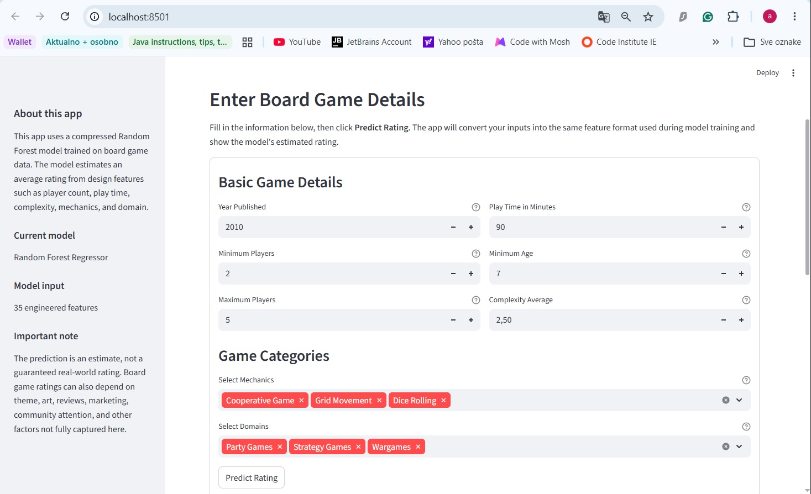
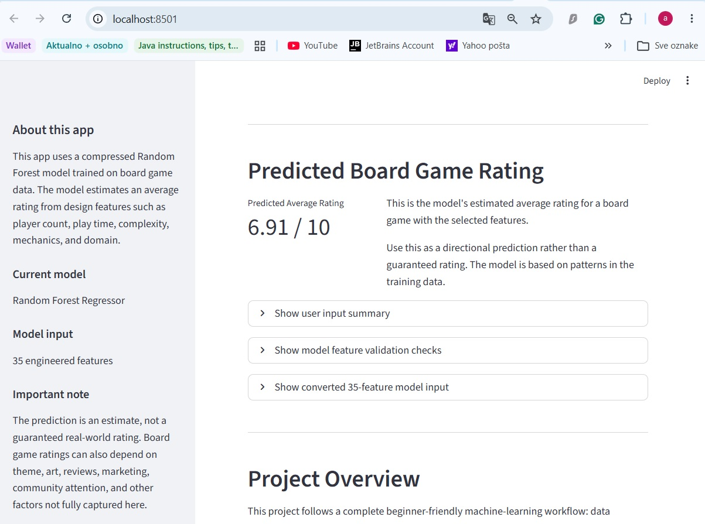

# Board Game Rating Predictor

Predictive analytics and machine-learning project that explores board game data and predicts a board game's average rating from design features such as player count, play time, minimum age, complexity, mechanics, and game domain.

The project includes data inspection, cleaning, exploratory data analysis, feature engineering, baseline modelling, model improvement, deployment artifact preparation, and a Streamlit prediction app.

## Table of Contents

- [Project Overview](#project-overview)
- [Project Goals](#project-goals)
- [Dataset Source](#dataset-source)
- [Technologies Used](#technologies-used)
- [Project Structure](#project-structure)
- [Machine-Learning Workflow](#machine-learning-workflow)
- [Streamlit App](#streamlit-app)
- [How to Run the Project Locally](#how-to-run-the-project-locally)
- [Model Limitations](#model-limitations)
- [Current Project Status](#current-project-status)
- [Next Steps](#next-steps)

## Project Overview

The goal of this project is to build a complete beginner-friendly predictive analytics workflow using board game data.

The final app allows a user to enter basic board game information and receive an estimated average rating from a trained machine-learning model.

The prediction is based on structured BoardGameGeek-style features, including:

- Year published
- Minimum and maximum player count
- Play time
- Minimum recommended age
- Complexity average
- Game mechanics
- Game domains/categories

## Project Goals

- Collect and inspect a board game dataset
- Clean and prepare the data for analysis
- Explore relationships between board game features and ratings
- Engineer model-ready features
- Train and compare baseline and machine-learning models
- Select a stronger model for prediction
- Save a deployment-friendly model artifact
- Create a Streamlit dashboard for presenting insights and predictions
- Document the project clearly for portfolio use


## Technologies Used

- Python
- Pandas
- NumPy
- Matplotlib
- Seaborn
- Scikit-learn
- Joblib
- Streamlit
- Jupyter / VS Code notebooks
- Git and GitHub


## Dataset Source

The dataset used in this project is the **Board Games** dataset from Kaggle.

- Dataset name: Board Games
- Dataset author: Andrew MVD
- Source platfrom: Kaggle
- Original file used: `bgg_dataset.csv`
- Dataset description: Data on approximately 20,000 board games scraped from BoardGameGeek.
- Dataset location in this project: `data/raw/bgg_dataset.csv`
- Dataset URL: https://www.kaggle.com/datasets/andrewmvd/board-games

## Project Structure

```text
board-game-rating-predictor/
│
├── data/
│   ├── raw/
│   │   └── bgg_dataset.csv
│   │
│   └── processed/
│       ├── bgg_cleaned.csv
│       ├── x_train_prepared.csv
│       ├── x_test_prepared.csv
│       ├── y_train.csv
│       ├── y_test.csv
│       ├── model_feature_names.csv
│       ├── imputation_summary.csv
│       ├── feature_engineering_decisions.csv
│       ├── baseline_model_performance.csv
│       ├── initial_model_comparison.csv
│       ├── initial_model_error_reduction_summary.csv
│       ├── baseline_modelling_results_summary.csv
│       ├── random_forest_feature_importance.csv
│       ├── best_model_summary.csv
│       ├── final_model_selection_notes.csv
│       └── deployment_friendly_model_artifact_summary.csv
│
├── models/
│   └── compressed_random_forest_rating_model.joblib
│
├── notebooks/
│   ├── 01_data_inspection.ipynb
│   ├── 02_data_cleaning.ipynb
│   ├── 03_exploratory_data_analysis.ipynb
│   ├── 04_feature_engineering_model_preparation.ipynb
│   ├── 05_baseline_model_training.ipynb
│   ├── 06_model_improvement_and_selection.ipynb
│   └── 07_deployment_friendly_model_artifact.ipynb
│
├── streamlit_app.py
├── requirements.txt
├── README.md
└── .gitignore

```

---

## Machine-Learning Workflow

### 1. Data Inspection

The raw dataset was inspected to understand its shape, columns, data types, missing values, and target variable.

The original dataset contains approximately 20,000 board games and includes features such as name, year published, player count, play time, minimum age, users rated, average rating, BGG rank, complexity, mechanics, and domains.

### 2. Data Cleaning

The dataset was cleaned and saved as:

```text
data/processed/bgg_cleaned.csv
```

The cleaning process prepared the data for analysis while preserving useful board game information.

### 3. Exploratory Data Analysis

Exploratory analysis was used to understand rating patterns and relationships between features.

Some of the strongest relationships with average rating came from:

- Complexity average
- Minimum age
- Play time
- Year published
- Player count

### 4. Feature Engineering

The modelling dataset excluded columns that could cause leakage or were not suitable for prediction.

Excluded columns included:

- `ID`
- `Name`
- `BGG Rank`
- `Users Rated`
- `Owned Users`

The final prepared feature set contains 35 engineered features, including numeric features, missing-value indicators, mechanic indicators, and domain indicators.

### 5. Baseline Modelling

A dummy baseline model was trained first to create a simple performance benchmark.

A Linear Regression model was then trained and compared against the dummy baseline.

### 6. Model Improvement

A Random Forest Regressor was trained and compared against the earlier models.

The Random Forest model achieved the strongest test performance among the compared models.

Final selected model:

```text
Random Forest Regressor
```

Test performance:

```text
MAE: 0.4912
RMSE: 0.6649
R²: 0.4993
```

### 7. Deployment-Friendly Artifact

The selected Random Forest model was saved as a compressed Joblib file:

```text
models/compressed_random_forest_rating_model.joblib
```

This compressed model artifact is small enough to be tracked in GitHub and used by the Streamlit app.

---

## Streamlit App

The project includes an interactive Streamlit app:

```text
streamlit_app.py
```

### App Interface

The Streamlit app provides a user-friendly form for entering board game details.



### Prediction Result

After the user submits the form, the app displays the predicted average rating.



The app allows users to enter board game details, including:

- Year published
- Minimum players
- Maximum players
- Play time
- Minimum age
- Complexity average
- Mechanics
- Domains

The app then:

1. Loads the trained Random Forest model
2. Loads the saved model feature names
3. Converts user inputs into the same 35-feature format used during training
4. Checks that the feature count and order match the model
5. Generates a predicted average rating
6. Displays the prediction clearly in the app

---

## How to Run the Project Locally

### 1. Clone the repository

```bash
git clone https://github.com/Agnogh/board-game-rating-predictor.git
cd board-game-rating-predictor
```

### 2. Create and activate a virtual environment

On Windows:

```bash
py -3.12 -m venv .venv
.venv\Scripts\activate
```

### 3. Install project dependencies

```bash
python -m pip install -r requirements.txt
```

### 4. Run the Streamlit app

```bash
python -m streamlit run streamlit_app.py
```

The app should open in the browser at:

```text
http://localhost:8501
```

---

## Model Limitations

The prediction should be interpreted as an estimate, not a guaranteed real-world rating.

Board game ratings can be influenced by many factors that are not fully captured in this dataset, such as:

- Theme
- Artwork
- Rulebook quality
- Component quality
- Marketing
- Community attention
- Reviewer influence
- Availability
- Expansions
- Player expectations

The model is useful for exploring patterns in the available structured data, but it should not be treated as a final judgement of a board game's quality.

---

## Current Project Status

The project currently includes:

- Completed data inspection
- Completed data cleaning
- Completed exploratory data analysis
- Completed feature engineering
- Completed baseline model training
- Completed model improvement and selection
- Completed deployment-friendly model artifact
- Completed Streamlit prediction app
- Completed deployment preparation
- Documentation in progress

---

## Next Steps

Possible future improvements include:

- Deploy the Streamlit app online
- Add screenshots of the app to the README
- Add feature-importance explanations to the app
- Add example board game presets
- Improve model performance through further tuning
- Try additional model types
- Add a shorter production-style requirements file