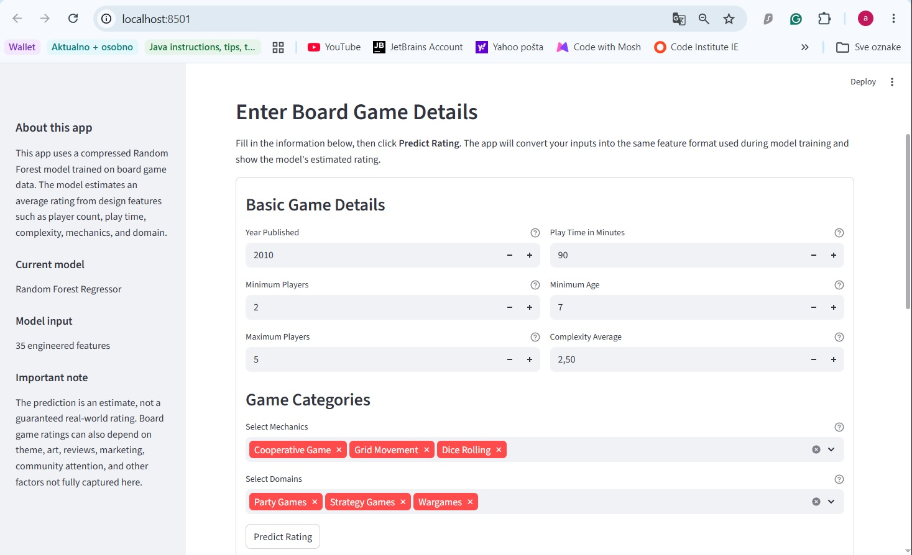
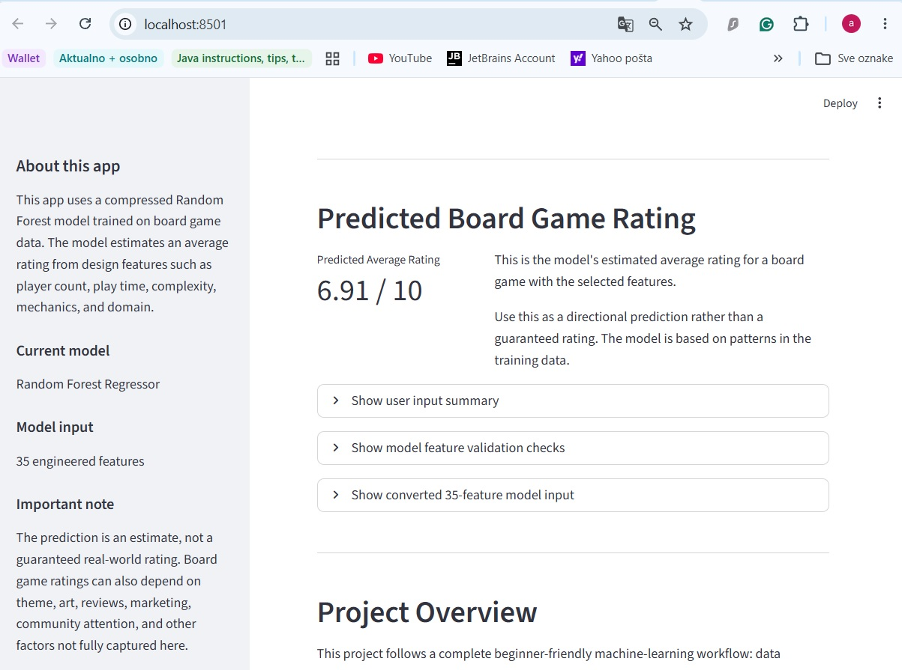

# Board Game Rating Predictor

Predictive analytics and machine-learning project that explores board game data and predicts a board game's average rating from design features such as player count, play time, minimum age, complexity, mechanics, and game domain.

The project includes data inspection, cleaning, exploratory data analysis, feature engineering, baseline modelling, model improvement, deployment artifact preparation, and a Streamlit prediction app.

## Table of Contents

- [Project Overview](#project-overview)
- [Project Goals](#project-goals)
- [Business Case](#business-case)
- [Business Requirements](#business-requirements)
- [Rationale: Mapping Business Requirements to Project Work](#rationale-mapping-business-requirements-to-project-work)
- [ML Business Case](#ml-business-case)
- [Project Hypotheses and Validation](#project-hypotheses-and-validation)
- [Dashboard Design](#dashboard-design)
- [Technologies Used](#technologies-used)
- [Dataset Source](#dataset-source)
- [Project Structure](#project-structure)
- [Machine-Learning Workflow](#machine-learning-workflow)
- [Streamlit App](#streamlit-app)
- [How to Run the Project Locally](#how-to-run-the-project-locally)
- [Model Limitations](#model-limitations)
- [Current Project Status](#current-project-status)
- [Next Steps](#next-steps)

## Project Overview

The goal of this project is to build a complete beginner-friendly predictive analytics workflow using board game data.

The final app allows a user to enter basic board game information and receive an estimated average rating from a trained machine-learning model.

The prediction is based on structured BoardGameGeek-style features, including:

- Year published
- Minimum and maximum player count
- Play time
- Minimum recommended age
- Complexity average
- Game mechanics
- Game domains/categories

## Project Goals

- Collect and inspect a board game dataset
- Clean and prepare the data for analysis
- Explore relationships between board game features and ratings
- Engineer model-ready features
- Train and compare baseline and machine-learning models
- Select a stronger model for prediction
- Save a deployment-friendly model artifact
- Build a Streamlit app for interactive predictions
- Document the project clearly for portfolio use
- Map data analysis and machine-learning work to clear business requirements
- Deploy the final prediction app online

## Business Case

This project is designed for a fictional board game designer, publisher, or product researcher who wants to explore how board game design characteristics relate to player reception.

When developing a new board game idea, early design choices such as player count, play time, minimum age, complexity, mechanics, and game category can influence how the game may be received by players. Before investing more time into design, production, marketing, or publishing, the stakeholder wants to better understand patterns in existing board game data.

The project uses historical BoardGameGeek-style data to support two practical goals:

1. Explore which board game characteristics appear to be associated with higher or lower average ratings.
2. Provide an interactive prediction app that estimates a board game's likely average rating from user-selected design features.

The prediction should not be interpreted as a guaranteed commercial outcome. The dataset does not contain full sales data, marketing spend, production quality, artwork quality, or availability information. Instead, the predicted average rating is used as a proxy for likely player reception based on the structured features available in the dataset.

## Business Requirements

### Business Requirement 1: Data Analysis

The stakeholder wants to understand which board game features are most related to average user rating.

This requirement is answered through conventional data analysis and visual exploration, including:

- Inspecting the dataset structure and target variable
- Cleaning and preparing the dataset
- Exploring the distribution of average ratings
- Reviewing relationships between rating and numerical features
- Exploring common mechanics and domains
- Identifying which features show the strongest relationships with average rating

### Business Requirement 2: Machine Learning Prediction

The stakeholder wants an interactive tool that can estimate a board game's average rating from design features.

This requirement is answered with a machine-learning regression model and a Streamlit app. The user can enter board game characteristics, and the app returns a predicted average rating.

### User Stories

As a board game designer, I want to explore how existing board game features relate to average ratings, so that I can make more informed design decisions.

As a board game publisher or product researcher, I want to estimate the likely player reception of a board game concept, so that I can compare different design ideas before investing further resources.

As a portfolio reviewer or technical stakeholder, I want to see a clear data cleaning, analysis, modelling, and deployment workflow, so that I can understand how the prediction system was built and evaluated.

## Rationale: Mapping Business Requirements to Project Work

| Business Requirement | Project Work | Output |
| --- | --- | --- |
| Understand how board game features relate to average rating | Data inspection, data cleaning, exploratory data analysis, correlation review, mechanics/domain analysis | EDA findings, charts, cleaned dataset, feature insights |
| Predict a board game's likely average rating from design features | Feature engineering, train/test split, baseline modelling, Random Forest model training, model evaluation | Trained regression model, saved model artifact, model performance metrics |
| Make the model usable by a non-technical user | Streamlit app design and deployment | Interactive web app with input form and prediction output |
| Make the workflow understandable and reproducible | README documentation, notebooks, Git/GitHub version control | Documented project structure, workflow summary, local run instructions, live app link |

## ML Business Case

The machine-learning task is a supervised regression problem.

The model predicts the target variable:

```text
Rating Average
```

The model input features are board game design characteristics prepared during feature engineering, including:

- Year published
- Minimum players
- Maximum players
- Play time
- Minimum age
- Complexity average
- Selected mechanics
- Selected domains/categories
- Missing-value indicators
- Log-transformed player-count and play-time features

The intended output is a predicted average board game rating on the same approximate scale as the original dataset rating average.

A successful model should perform better than a simple baseline model and provide useful directional estimates for comparing board game design ideas. In this project, a Dummy baseline model, Linear Regression model, and Random Forest Regressor were compared. The Random Forest model was selected because it achieved the strongest test performance among the models tested.

Final selected model:

```text
Random Forest Regressor
```

Final test performance:

```text
MAE: 0.4912
RMSE: 0.6649
R²: 0.4993
```

The model is useful for exploring patterns in board game data, but it should not be treated as a guarantee of commercial success or final game quality.

## Project Hypotheses and Validation

### Hypothesis 1: More complex board games tend to receive higher average ratings.

Validation approach:

- The relationship between `Complexity Average` and `Rating Average` was explored during EDA.
- `Complexity Average` showed the strongest positive correlation with the target among the numerical candidate features.
- Random Forest feature importance also identified `Complexity Average` as the most important model feature.

Conclusion:

This hypothesis was supported by the available dataset. Complexity appears to be one of the strongest structured indicators associated with higher average ratings.

### Hypothesis 2: Minimum recommended age is positively related to average rating.

Validation approach:

- The relationship between `Min Age` and `Rating Average` was reviewed during EDA.
- `Min Age` showed a positive relationship with average rating.
- `Min Age` was also among the more important features in the final Random Forest model.

Conclusion:

This hypothesis was partly supported. Games aimed at older audiences may receive higher average ratings, although age is likely acting as a proxy for other design factors such as complexity, strategy depth, and theme.

### Hypothesis 3: Mechanics and domains contain useful predictive information.

Validation approach:

- The `Mechanics` and `Domains` columns were inspected during EDA.
- Common mechanics and domains were converted into model-ready indicator features.
- The final model used these engineered features alongside numerical features.

Conclusion:

This hypothesis was supported. Mechanics and domains added useful design-context information to the model, although numerical features such as complexity and year published had stronger overall importance in the final Random Forest model.

## Dashboard Design

The deployed Streamlit app is designed as a single-page interactive prediction dashboard.

The dashboard includes:

- A short project introduction
- A sidebar summary explaining the app and model
- Input widgets for board game design features
- Multi-select widgets for mechanics and domains
- A prediction button
- A clear predicted average rating output
- Expandable sections showing model details, selected inputs, validation checks, and the final 35-feature model input table

The dashboard answers the machine-learning business requirement by allowing a user to enter board game details and receive a predicted average rating.

The data-analysis business requirement is primarily answered in the project notebooks and summarized in the README. The app focuses on making the final trained model usable through an interactive interface.

## Technologies Used

- Python
- Pandas
- NumPy
- Matplotlib
- Seaborn
- Scikit-learn
- Joblib
- Streamlit
- Jupyter / VS Code notebooks
- Git and GitHub


## Dataset Source

The dataset used in this project is the **Board Games** dataset from Kaggle.

- Dataset name: Board Games
- Dataset author: Andrew MVD
- Source platform: Kaggle
- Original file used: `bgg_dataset.csv`
- Dataset description: Data on approximately 20,000 board games scraped from BoardGameGeek.
- Dataset location in this project: `data/raw/bgg_dataset.csv`
- Dataset URL: https://www.kaggle.com/datasets/andrewmvd/board-games

## Project Structure

```text
board-game-rating-predictor/
│
├── data/
│   ├── raw/
│   │   └── bgg_dataset.csv
│   │
│   └── processed/
│       ├── bgg_cleaned.csv
│       ├── x_train_prepared.csv
│       ├── x_test_prepared.csv
│       ├── y_train.csv
│       ├── y_test.csv
│       ├── model_feature_names.csv
│       ├── imputation_summary.csv
│       ├── feature_engineering_decisions.csv
│       ├── baseline_model_performance.csv
│       ├── initial_model_comparison.csv
│       ├── initial_model_error_reduction_summary.csv
│       ├── baseline_modelling_results_summary.csv
│       ├── random_forest_feature_importance.csv
│       ├── best_model_summary.csv
│       ├── final_model_selection_notes.csv
│       └── deployment_friendly_model_artifact_summary.csv
│
├── models/
│   └── compressed_random_forest_rating_model.joblib
│
├── notebooks/
│   ├── 01_data_inspection.ipynb
│   ├── 02_data_cleaning.ipynb
│   ├── 03_exploratory_data_analysis.ipynb
│   ├── 04_feature_engineering_model_preparation.ipynb
│   ├── 05_baseline_model_training.ipynb
│   ├── 06_model_improvement_and_selection.ipynb
│   └── 07_deployment_friendly_model_artifact.ipynb
│
├── streamlit_app.py
├── requirements.txt
├── README.md
└── .gitignore

```

---

## Machine-Learning Workflow

### 1. Data Inspection

The raw dataset was inspected to understand its shape, columns, data types, missing values, and target variable.

The original dataset contains approximately 20,000 board games and includes features such as name, year published, player count, play time, minimum age, users rated, average rating, BGG rank, complexity, mechanics, and domains.

### 2. Data Cleaning

The dataset was cleaned and saved as:

```text
data/processed/bgg_cleaned.csv
```

The cleaning process prepared the data for analysis while preserving useful board game information.

### 3. Exploratory Data Analysis

Exploratory analysis was used to understand rating patterns and relationships between features.

Some of the strongest relationships with average rating came from:

- Complexity average
- Minimum age
- Play time
- Year published
- Player count

### 4. Feature Engineering

The modelling dataset excluded columns that could cause leakage or were not suitable for prediction.

Excluded columns included:

- `ID`
- `Name`
- `BGG Rank`
- `Users Rated`
- `Owned Users`

The final prepared feature set contains 35 engineered features, including numeric features, missing-value indicators, mechanic indicators, and domain indicators.

### 5. Baseline Modelling

A dummy baseline model was trained first to create a simple performance benchmark.

A Linear Regression model was then trained and compared against the dummy baseline.

### 6. Model Improvement

A Random Forest Regressor was trained and compared against the earlier models.

The Random Forest model achieved the strongest test performance among the compared models.

Final selected model:

```text
Random Forest Regressor
```

Test performance:

```text
MAE: 0.4912
RMSE: 0.6649
R²: 0.4993
```

### 7. Deployment-Friendly Artifact

The selected Random Forest model was saved as a compressed Joblib file:

```text
models/compressed_random_forest_rating_model.joblib
```

This compressed model artifact is small enough to be tracked in GitHub and used by the Streamlit app.

---

## Streamlit App

The project includes an interactive Streamlit app for predicting board game rating based on user-selected game characteristics.

**Live app:** [Board Game Rating Predictor](https://board-game-rating-predictor-by-agnogh.streamlit.app/)

### App Interface

The Streamlit app provides a user-friendly form for entering board game details.



### Prediction Result

After the user submits the form, the app displays the predicted average rating.



The app allows users to enter board game details, including:

- Year published
- Minimum players
- Maximum players
- Play time
- Minimum age
- Complexity average
- Mechanics
- Domains

The app then:

1. Loads the trained Random Forest model
2. Loads the saved model feature names
3. Converts user inputs into the same 35-feature format used during training
4. Checks that the feature count and order match the model
5. Generates a predicted average rating
6. Displays the prediction clearly in the app

---

## How to Run the Project Locally

### 1. Clone the repository

```bash
git clone https://github.com/Agnogh/board-game-rating-predictor.git
cd board-game-rating-predictor
```

### 2. Create and activate a virtual environment

On Windows:

```bash
py -3.12 -m venv .venv
.venv\Scripts\activate
```

### 3. Install project dependencies

```bash
python -m pip install -r requirements.txt
```

### 4. Run the Streamlit app

```bash
python -m streamlit run streamlit_app.py
```

The app should open in the browser at:

```text
http://localhost:8501
```

---

## Model Limitations

The prediction should be interpreted as an estimate, not a guaranteed real-world rating.

Board game ratings can be influenced by many factors that are not fully captured in this dataset, such as:

- Theme
- Artwork
- Rulebook quality
- Component quality
- Marketing
- Community attention
- Reviewer influence
- Availability
- Expansions
- Player expectations

The model is useful for exploring patterns in the available structured data, but it should not be treated as a final judgement of a board game's quality.

---

## Current Project Status

The project currently includes:

- Completed data inspection
- Completed data cleaning
- Completed exploratory data analysis
- Completed feature engineering
- Completed baseline model training
- Completed model improvement and selection
- Completed deployment-friendly model artifact
- Completed Streamlit prediction app
- Completed online Streamlit deployment
- Completed README documentation

---

## Next Steps

Possible future improvements include:

- Add feature-importance explanations to the app
- Add example board game presets
- Improve model performance through further tuning
- Try additional model types
- Add a shorter production-style requirements file